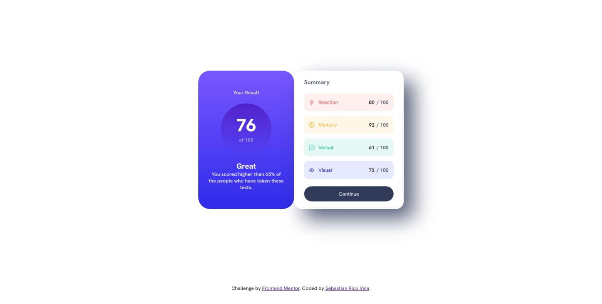
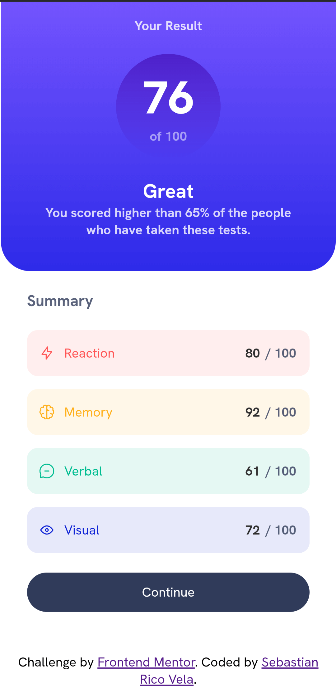

# Frontend Mentor - Results summary component solution

This is a solution to the [Results summary component challenge on Frontend Mentor](https://www.frontendmentor.io/challenges/results-summary-component-CE_K6s0maV). 

## Table of contents
- [Frontend Mentor - Results summary component solution](#frontend-mentor---results-summary-component-solution)
  - [Table of contents](#table-of-contents)
  - [Overview](#overview)
    - [Screenshot](#screenshot)
    - [Links](#links)
    - [Built with](#built-with)
    - [What I learned](#what-i-learned)
  - [Author](#author)

## Overview
This is a simple page to practice HTML, CSS and JavaScript. 
The challenge comes from the Frontend Mentor page. 

### Screenshot

### Links
- Solution URL: [Link](https://resultssummarycomponent-agilepanda482.netlify.app/)

### Built with
- HTML5
- CSS
- JavaScript
- Flexbox
- Mobile-first workflow

### What I learned
In this challenge, I learned mainly how to keep using CSS correctly to make it look as fluid and responsive as possible, as well as how to use HTML tags and improve my frontend JS usage.

## Author
- Frontend Mentor - [@AgilePanda482](https://www.frontendmentor.io/profile/AgilePanda482)
- Linkedin - [@AgilePanda482](https://www.linkedin.com/in/AgilePanda482/)